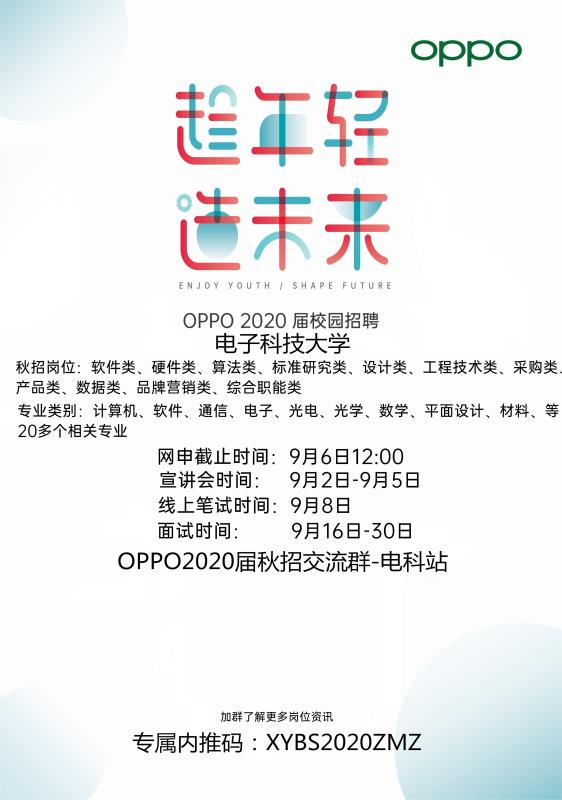

#咪咕校招

http://evp.51job.com/2019/MIGU/phone/template/about.html


#阿里巴巴本地生活


```
阿里巴巴本地生活2020届毕业生招聘内推开始啦！
饿了么、口碑，“重新定义城市生活”为未来目标，让城市生活更便利、更美好。
 
招聘对象
2019年11月-2020年10月期间毕业的学生
 
岗位信息
研发类：Java、C/C++、iOS、Android、前端、测试开发、数据研发、安全工程师
算法类：机器学习、NLP、运筹优化、计算机视觉、其他
UED类：创意设计师、体验设计师、用户体验研究
产品类：平台型产品经理（技术领域）、用户型产品经理
工作地点：上海、杭州、北京
 
投递链接
https://survey.alibaba.com/apps/zhiliao/ZxZo7GoDQ
```


# 51job

```
【51job校园秋招汇总第一弹】
秋招之战已经一触即发👻👻
同城艺龙、ABB集团、戴尔科技、华为、APPLE.……
各大名企校招计划纷纷开启～
🌻华为（财经类、服务类、销售类、研发类等）  网申链接http://xym.51job.com/wechat/vuectmjobs/#/index?id=042f78ca-4590-4cdc-8112-8968d72f5b5f
🌷 戴尔（IVE Software Engineer、ThinOS Software Engineer (RG/Intern)、Software Development Engineer、Software Engineer等）   网申链接http://xym.51job.com/wechat/vuectmjobs/#/index?id=7cb6428c-65e5-4b17-99ea-f96ba4ec2743
💐同程艺龙 （产品经理、产品运营、UI设计师、市场营销测试工程师等） 网申链接http://join.ly.com/ly2020/current.html
🌹 ABB集团（产品工程师、电子研发工程师、销售工程师等）  网申链接http://xym.51job.com/wechat/vuectmjobs/#/index?id=4f55be63-236c-4854-a900-68b7c682e1c1
🍎 APPLE（Product Design Engineer、Siri Domain Engineer、NLP Engineer、Speech Engineer、Technical Operations Specialist等）  网申链接http://xym.51job.com/wechat/vuectmjobs/#/index?id=c7ec6723-a76e-4e99-b177-f601abefe4b0
🌾伊利（人力资源培训生、IT培训生、电商培训生、流程培训生、财务培训生）http://xym.51job.com/wechat/vuectmjobs/#/index?id=aab297df-5841-45dd-8d80-2d497f9ad8c1
🌺 亚马逊（市场拓展管理培训生、市场拓展管理培训生、云计算解决方案架构师、软件开发工程师等）  网申链接http://xym.51job.com/wechat/vuectmjobs/#/index?id=5987212e-1bfc-4eb5-a1e2-78888e128216
🌴 施耐德电气 （电子设计工程师、嵌入式软件工程师 Firmware Engineer、机械工程师 Mechanical Engineer、服务销售工程师等）网申链接http://xym.51job.com/wechat/vuectmjobs/#/index?id=d10192a2-82fc-4441-b51f-a9bdeca1af07
关注51job校园，更多名企offer一触即发🎉 🎉 🎉

🌟 【51job校园推荐实习生-银行&国企】
🐔 东亚银行实习生
网申链接[图片]https://m.51job.com/search/jobdetail.php?jobid=114338281
🐛  招商银行实习生
网申链接[图片]https://m.51job.com/search/jobdetail.php?jobid=106192740
🐹 中国民生银行实习生
网申链接[图片]https://m.51job.com/search/jobdetail.php?jobid=112205196
🐷 平安银行实习生
网申链接[图片]https://m.51job.com/search/jobdetail.php?jobid=115262193
🐍 Maybank实习生
网申链接[图片]https://m.51job.com/search/jobdetail.php?jobid=114105740
🐠中国光大银行
网申链接[图片]https://m.51job.com/search/jobdetail.php?jobid=113189213
赶快行动起来吧🎉 🎉 🎉
近期会不断更新各种行业实习信息
欢迎持续关注私聊小编你们关注的企业

```


## 滴滴

http://campus.didichuxing.com/oversea/positions/1


# 阿里钉钉


# 阿里飞猪

https://mp.dfkhgj.com/trip/campus-hire/home/index.html?tdsourcetag=s_pctim_aiomsg&_projVer=1.0.14


# 4399

https://mp.weixin.qq.com/s?__biz=MzA3ODAwNjkwMA==&mid=2649291146&idx=1&sn=90369939a6a56f3536481886f9adae87&chksm=87550691b0228f87ba11c33b7230adf1f240253e2a48efa2506c446e7001303e23eb8f9e07d8&mpshare=1&scene=23&srcid=&sharer_sharetime=1565856313034&sharer_shareid=a6e9f29dca4bdf371f9f5d9549c933b1#rd


# tap4fun

https://mp.weixin.qq.com/s?__biz=MzA5ODEzNjcxNA==&mid=2460597182&idx=1&sn=852aa3d059f80fa20d26421a50e6739e&chksm=87cb3c5bb0bcb54d099643854c5fc42137dbd88f72c2f92f0ee1aa911154d5b09720e7e61c69&mpshare=1&scene=23&srcid=&sharer_sharetime=1565600027857&sharer_shareid=eec7c682c26cddff900dfe12b160f99c#rd

```
【tap4fun】———全球领先的手游公司，专注于SLG游戏市场。👏
 2020届秋季校园招聘正式启动啦！
招聘岗位包含程序类（游戏开发、web开发）
运营策划类（游戏运营、游戏策划、产品经理）
美术类（游戏美术设计、影视CG设计）
【薪资待遇】
13W-20W/年
【工作地点】成都高新区天府软件园
【福利诱人】
天府软件园区独立办公楼
数万平米Google式开放办公环境
苹果、外星人高端办公设备，人手万元办公椅
免费停车场、健身房、免费私教、水果饮料无限量供应
超多xbox、switch、ps4、台球、桌球等游戏设备
【招聘对象】
面向2020应届毕业生
网申投递入口：campus.tap4fun.com
扫码加入官方答疑QQ群 
```

# 招行

```
【招商银行·招银网络科技2020届校招】
招银网络科技是招商银行的软件中心，公司技术栈贴近互联网技术，加班不多，工资福利蛮不错，与网上说得一致。

校招岗位：
软件开发，测试开发，前端开发，移动端开发，数据研发，算法
工作地点：
成都、深圳、杭州
内推码：2678WJSZ
网申截止时间：9月5日（第一批）
网申方式：见图
感觉这两年招人蛮多的，感觉面试难度没有很大，大家可以踊跃尝试。我是19届刚入职的，有问题可以咨询我，联系方式：13076049880（微信/QQ）
（帮学长转）
```


# 深信服


# 阿里企业智能事业部

```
阿里巴巴企业智能事业部 
开拓toB蓝海 这里需要你的力量
这里有复杂的业务场景 
是阿里黑科技的演练场
帮老板收Java开发简历 
直接送到老板手里
事实掌握内推状态 省心省力
面试以考察基础为主 
有一二线厂实习经历优势很大
有想法的同学请将简历发邮箱
zhanlu.szq@alibaba-inc.com


阿里巴巴校招要开始了~
部门：阿里巴巴集团-企业智能事业部
岗位：JAVA开发工程师/前端开发工程师/测试工程师
毕业时间：2020年
邮件：xiaoxiaosir.chenxg@alibaba-inc.com
微信：13666654105（欢迎加微信）
坐标：杭州西溪园区（阿里巴巴本部）
部门介绍：
企业智能事业部，是阿里巴巴内部协作/运营平台的建设者，是阿里众多黑科技的孵化器和首次实践的应用场景，负责所有内部系统，包括：人事EHR、行政、财务、采购、IT服务、资产、外包管理、工作流、阿里内外协同工作系统、阿里郎和办公网络等系统。
通过生态化、数据化、移动化、国际化和服务化等策略：促进阿里组织文化升级、提升公司协作/运营效率、提升园区科技感。我们致力于打造世界一流的企业在线协作与组织运营管理平台！阿里巴巴期望您的加入！
```

 # oppo

```趁年轻 造未来——2020OPPO校园招聘火热进行中！
【招聘流程】
1、招聘对象：具有本科学历和学位及以上的 2020年应届毕业生；
2、简历截止时间：9月6日 12:00   
3、宣讲时间：9月2日-9月5日
4、线上笔试时间：9月8日
5、面试时间：9月16-30日
【岗位需求】   
1、研发类：软件类、硬件类、算法类、标准研究类、设计类、工程技术类、产品类、数据类  （每位同学最多可申请两个职位）
2、相关专业：计算机、软件、通信、电子、电信、机械、机电、光电、集成电路、微电子材料、应用光学、数学、数据挖掘、机器学习、人工智能、数字图像处理、电气自动化、机电一体化、可靠性、化学、物理、设计类。产品类岗位：社会学、心理学、金融学、 艺术类等相关专业 
3、非研发类：品牌营销类、综合职能类、采购类（相关专业：社会、心理、统计、市场营销、法律、会计、电子信息、通讯工程、不限专业等）
【薪资福利】
1、研发类岗位：本科年薪22w，硕士年薪24w，北上深另有1.2k/月生活补贴
2、非研发类岗位：本科年薪19w，硕士年薪22w，北上深另有1.2k/月生活补贴
3、我们将为特别优秀的学生提供更有竞争力的薪酬，本科/硕士年薪30w起，博士年薪45w起
4、年轻单纯的工作氛围，简单愉快的同事关系，让工作更快乐
5、两年一次的出国游，各类健身器材、舞蹈室和社团活动
【关于OPPO】
 OPPO于2008年推出第一款“笑脸手机”，由此开启探索和引领至美科技之旅。今天，OPPO 凭借以Find和R系列手机为核心的智能终端产品，ColorOS操作系统，以及 OPPO Cloud、OPPO+等互联网服务，让全球消费者尽享至美科技。OPPO业务遍及全球30多个国家和地区，拥有6大研究所和4大研发中心，并在伦敦设有全球设计中心。超过4万名OPPO员工共同致力于为人类社会创造新的价值。OPPO坚持以开放包容的心态，拥抱每一位奋发向上的年轻人，这个秋天，我们期待与你同行， 以年轻的力量共创未来！
【专属内推码：XYBS2020ZMZ】
网申地址：http://oppo.zhaopin.com
oppo秋招官方QQ群号801113048（及二维码）  
```



# 美团点评

```
【美团点评2020校园招聘全面启动】
【简历投递】
→北京、上海、厦门：即日起至2019年10月15日
→武汉、哈尔滨：即日起至9月10日
→南京、西安、成都：即日起至9月17日
若所选面试城市通道关闭，同学们可以选择其他城市或远程面试。
【笔试安排】8月22日-10月16日
【面试安排】
→北京、上海：即日起至11月
→武汉、哈尔滨：9月16日-9月20日
→南京、西安、成都：9月23日-9月27日
【宣讲安排】8月中旬-9月中旬：北京、上海、南京、武汉、哈尔滨、合肥、西安、成都、大连、广州等
欢迎大家加入美团点评，一起无畏挑战，极速成长~
更多信息请关注【美团点评招聘】公众号！
```


# 阿里

```
【阿里巴巴2020届毕业生招聘启动通知】 
面向人群：2020届毕业生（毕业时间：2019.11.1-2020.10.31）
招聘职位：技术、产品、设计、游戏、内容、运营等众多职位等你来！(职位详见阿里巴巴校招官网)
招聘流程：
网申/内推→简历评估→在线笔试（可选）→素质测评（可选）→面试→发放录用意向书
网申地址：https://campus.alibaba.com
网申/内推： 8月1日-9月12日
在线笔试： 8月28日-8月30日
在线素质测评：8月1日-9月12日
新世界，由你造！
更多资讯请关注微信公众号：阿里技术栈
```

